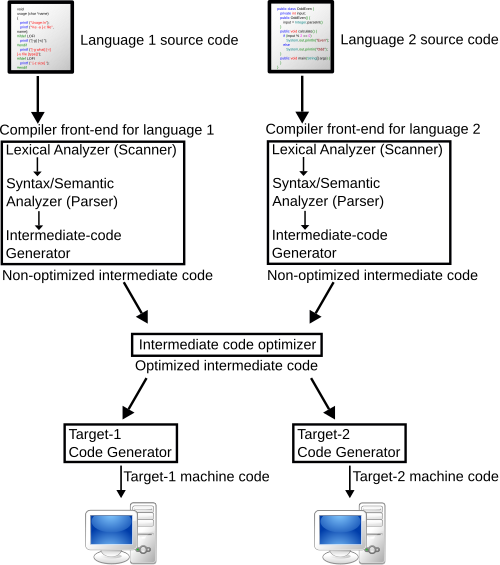
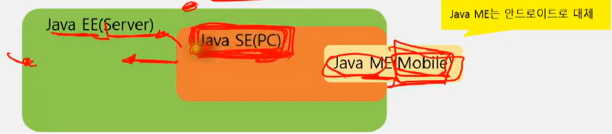
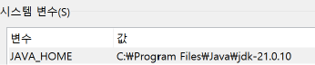
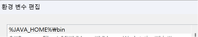
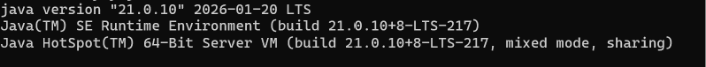
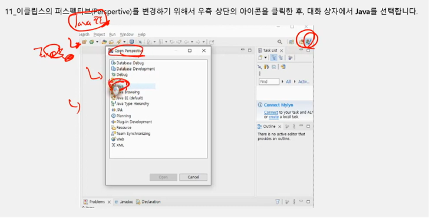
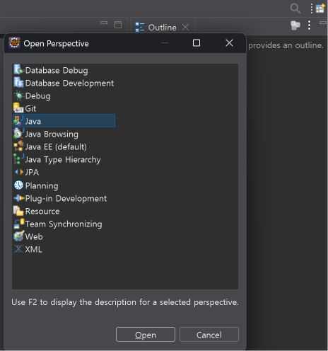

# 1. 프로그래밍 언어의 발전 과정
## 1.1 프로그래밍 언어 종류
- 기계어 :  CPU가 인식할 수 있는 명령문을 사람이 직접 프로그래밍 하는 방식
- 어셈블리어 : 2진 코드로 작성한 기계어의 불편한 점을 개선해서 Mov(move), LDA(load) 같은 영어 단어를 이용해서 프로그래밍 하는 방식
- 고급언어 : 사람이 사용하는 언어 기반으로 컴퓨터에게 작업을 시키는 방식

## 1.2 컴파일러란
- 자바와 같은 고급 언어는 사람이 사용하는 언어 기반으로 작성되었으므로 실행 시 바로 CPU가 인식하지 못함
- 고급 언어로 작성한 실행문을 CPU가 인식할 수 있는 2진 명령어로 변환하는 과정을 컴파일링이라고 함
- 이 변환 과정을 수행하는 도구를 컴파일러(Compiler)라고 함 

---

# 2. 자바 소개
- 자바는 1995년 제임스 고슬링에 의해서 창안되었으며 초기 언어는 Oak로 불림
- 자바는 전자렌지나 TV처럼 가전 제품에 내장될 소프트웨어 개발용 언어
- 모든 플랫폼(운영체제)에 독립적으로 동작

## 자바(JDK) 버전별 발전 과정

## JDK 종류
- Java는 여러 기업이나 단체가 참여해서 기능을 정의하고 구현하는 오픈 소스
- Open JDK는 오픈 소스 이므로 자유롭게 이용 가능
- jdk.java.net에서 다운로드 받을 수 있음
- Oracle JDK는 Oracle 회사가 트고하해서 제공하는 JDK이므로 개발 시에는 무료로 사용할수 있으나 상용 서비스 시 라이센스비를 지불해야 함

---

# 3. 자바 언어의 특징
- 자바는 고급 프로그래밍 언어
- 객체 지향 언어
- 모든 운영체제에서 실행 가능
- 메모리 관리를 자동을 수행
- 무료 라이브러리가 풍부하게 제공
- 멀티 스레드 기능 제공 

---

# 4. 자바 기술의 종류
- Java SE : 데스크톱 컴퓨터의 응용 프로그램 개발용 자바 기술
- Java EE : 서버용 응용 프로그램 개발용 자바 기술
- Java ME : 소규모 장치에서 실행되는 응용 프로그램 개발용 자바 기술
- 자바 기술 분포 

---

# 5. Java SE 개발 환경 설치하기

### 1. 자바 개발 도구(JDK) 설치
- https://www.oracle.com/java/technologies/downloads
- 실습은 jdk21

### 2. 환경 변수 설정하기
- 환경 변수 
- 
- 환경 변수 시스템 변수 Path에 %JAVA_HOME%\bin 설정
- 최상단으로 이동

- 설치 후 CMD에 "java -version' 명령어 치면 성공시 아래와같이 나옴

### 3. API문서 즐겨찾기에 추가하기
https://docs.oracle.com/en/java/javase/21/docs/api/java.base/module-summary.html

### 4. Visual Studio Code 설치하기

### 5. Eclipse 설치하기
- Eclipse IDE for Enterprise Java and Web Developers 설치 
- EE안에 SE도 포함되기때문에 상관없음 

